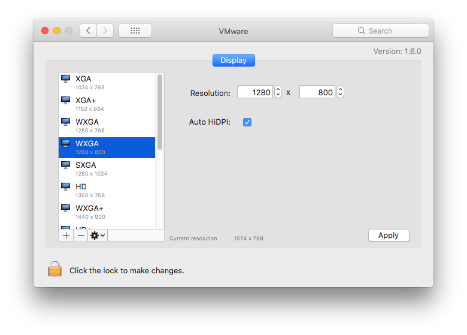
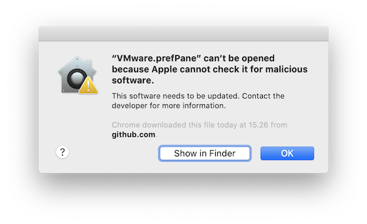

#  VMware.PreferencePane

[](https://github.com/MarLoe/VMware.PreferencePane/blob/master/LICENSE)

This is a System Preferences pane to change screen resolution on your macOS guest.



## Introduction

When running macOS as a guest on a WMware host, the way you change screen resolution is using a command line tool that comes with VMware Tools:

```bash
/Library/Application Support/VMware Tools/vmware-resolutionSet <width> <height>
```

I access my virtual macOS via [VNC Viewer](https://www.realvnc.com/en/connect/download/viewer) from different workstations with different screen sizes. This leaves me with the need to change screen size often - and for some reason I always has to [google](https://www.google.dk/search?q=vmware+osx+change+resolution) how to do this.

## Installing - Using The Installer

Download [VMware.prefPane.pkg](https://github.com/MarLoe/VMware.PreferencePane/releases/latest/download/VMware.prefPane.pkg
) and run it.

You might have to right click and select "Open" from the popup menu.

NOTE: The installer is only able to install the VMware Preferene Pane for all users.

## Installing - Manual

Please download and unzip [VMware.prefPane.zip](https://github.com/MarLoe/VMware.PreferencePane/releases/latest/download/VMware.prefPane.zip
) from the [latest release](https://github.com/MarLoe/VMware.PreferencePane/releases/latest).

Then open it by double clicking it. If you get a message that "VMware.prefPane can't be opened because it is from an unidentified developer", then you can right-click "VMware.prefPane" and select open from the menu.

You can also manually copy the VMware.prefPane to one of these locations:

### Current user

```~/Library/PreferencePanes```

```bash
cp -r VMware.prefPane ~/Library/PreferencePanes/
```

### All users

```/Library/PreferencePanes```

```bash
cp -r VMware.prefPane /Library/PreferencePanes/
```

### **macOS** Catalina

On macOS Catalina it seems to be even harder to run an unsigned custom preference pane. But here is how. Once you have installed the VMWare preference pane, try to start it. You might get this error message:



If this happens, you should go to "Security & Privacy" and click the "Open Anyway" button:


It will most likely result in an error message saying:
**"Could not load VMware preference pane."** That is not a problem, just press Ok. Now you should quit the System Preferences aand the open it again. Now when you select the VMWare preference pane, you should get the old familiar warning where you can select "Open":


Alternatively to all this, you could just remove the quarantine Extended Attribute on the file from ther terminal:

```bash
sudo xattr -d com.apple.quarantine /Library/PreferencePanes/VMware.prefPane
```

Thanks to [melmaninga](https://github.com/melmaninga) for suggesting this.

## Uninstall

Right-click on the VMware icon in System Preferences.


You can also delete it manually by removing the "VMware.prefPane" file from either  

```~/Library/PreferencePanes```

or

```/Library/PreferencePanes```


## Building

This project uses [cocoapods](https://cocoapods.org/). Please install cocoapods and from the terminal run this command from the project root folder:

```bash
pod install
```

Open the VMware.PreferencePane.xcworkspace workspace and build the project as normal.

## Debugging

Since ["System Integration Protection"](https://developer.apple.com/library/content/documentation/Security/Conceptual/System_Integrity_Protection_Guide/Introduction/Introduction.html) was introduced in macOS it is no longer possible to debug system shipped applications.

There are few workarounds for this.

One is of cause to [disable System Integration Protection](https://developer.apple.com/library/content/documentation/Security/Conceptual/System_Integrity_Protection_Guide/ConfiguringSystemIntegrityProtection/ConfiguringSystemIntegrityProtection.html). I find that too invasive.

Another is making a copy of the "System Preferences" application and resign it. See [stack**overflow**](https://stackoverflow.com/a/40708258) for more information on this approach.

I went with the test bed application. So I created "VMware.Debug", which basically loads the VMware.prefPane and displays it. Simply select this target and press "Run".

Selecting the "VMware" target will launch the VMware.prePane initiating a (re)install in "System Preferences" application. You won't be able to debug, but you can test the preference pane live.
> Sometimes it can be neccessary to remove the existing instalation from the "System Preferences" application first.
>
>

## TL;DR

Download [VMware.prefPane.pkg](https://github.com/MarLoe/VMware.PreferencePane/releases/latest/download/VMware.prefPane.pkg
) and run it!

## License

VMware.PreferencesPane is released under the [MIT License](https://github.com/MarLoe/VMware.PreferencePane/blob/master/LICENSE).

## Acknowledgements

VMware is a registered trademark of [VMware Inc.](http://vmware.com)
